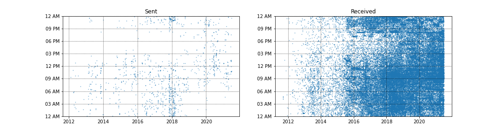

# Gmail Data Analysis

## Goal
* Answer the following questions - 
  1. How many emails did I send during a given timeframe?
  2. At what times of the day do I send and receive emails with Gmail?
  3. What is the distribution of emails received per day?
  4. What is the distribution of emails received per hour?
  5. Which is my most active day in terms of emails?

## Dataset

The data was obtained from https://takeout.google.com/settings/takeout. Due to privacy reasons, the dataset is not included in this repository. After downloading the dataset containing all the emails, the compressed file was unzipped to obtain file with an `.mbox` extension. In order to read this, the [mailbox library](https://pypi.org/project/mailbox/#description) was used. The following fields were extracted from the mailbox object -
  1. Subject
  2. From
  3. Date
  4. To
  5. Label - Gmail treats labels as folders for the purposes of IMAP. [^1]
  6. Thread - Gmail provides a thread ID to associate groups of messages in the same manner as in the Gmail web interface [^1]

## Steps prior to analysis
1. Data cleaning - 
  1.1 Consisted of removing `NaN`
  1.2 Conversion of dataframe objects to a more suitable data format
  1.3 Extraction of email ids from the `from` field using regular expressions
  1.4 Dropping unneccessary columns
2. Refactoring timezones -
  2.1 Done using `pytz` and `pandas`

## Analysis

### 1. Number of Emails
* Timeframe considered - 
  * Start of dataset:  Mon 12 Sep 2011 04:12 AM
  * End of dataset:  Mon 28 Jun 2021 08:53 PM
* How many emails were received and sent?
  * Received = 62180
  * Sent = 1172
  * Here is a scatter plot for the distribution of emails sent and received per time of day
  

[^1]: Source: [Gmail for developers](https://developers.google.com/gmail/imap/imap-extensions)
